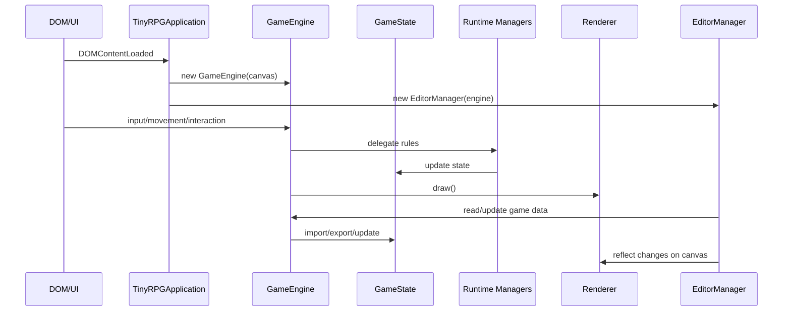

# Engine Architecture

This document summarizes the current Tiny RPG Maker engine architecture based on the implementation in `src/`.

## Overview

```mermaid
flowchart TD
    A[src/main.ts<br/>TinyRPGApplication] --> B[GameEngine]
    A --> C[EditorManager]
    A --> D[TinyRpgApi]
    A --> E[ShareUtils]
    A --> F[TextResources]

    B --> G[GameState]
    B --> H[InputManager]
    B --> I[Renderer]
    B --> J[TileManager]
    B --> K[NPCManager]
    B --> L[DialogManager]
    B --> M[InteractionManager]
    B --> N[EnemyManager]
    B --> O[MovementManager]
    B --> P[CombatStunManager]

    G --> G1[StateWorldManager]
    G --> G2[StatePlayerManager]
    G --> G3[StateEnemyManager]
    G --> G4[StateObjectManager]
    G --> G5[StateVariableManager]
    G --> G6[StateSkillManager]
    G --> G7[StateDialogManager]
    G --> G8[StateItemManager]
    G --> G9[GameStateLifecycle]
    G --> G10[GameStateScreenManager]
    G --> G11[StateDataManager]
    G --> G12[GameStateDataFacade]
    G --> G13[GameStateWorldFacade]

    I --> I1[RendererTileRenderer]
    I --> I2[RendererEntityRenderer]
    I --> I3[RendererDialogRenderer]
    I --> I4[RendererHudRenderer]
    I --> I5[RendererOverlayRenderer]
    I --> I6[RendererEffectsManager]
    I --> I7[RendererMinimapRenderer]
    I --> I8[RendererSpriteFactory]
    I --> I9[RendererPalette]
    I --> I10[RendererTransitionManager]

    C --> C1[EditorState]
    C --> C2[EditorDomCache]
    C --> C3[EditorRenderService]
    C --> C4[EditorTileService]
    C --> C5[EditorNpcService]
    C --> C6[EditorEnemyService]
    C --> C7[EditorObjectService]
    C --> C8[EditorVariableService]
    C --> C9[EditorPaletteService]
    C --> C10[EditorWorldService]
    C --> C11[EditorShareService]
    C --> C12[EditorHistoryManager]
    C --> C13[EditorUIController]
    C --> C14[EditorEventBinder]
    C --> C15[EditorInteractionController]

    C3 --> B
    C4 --> B
    C5 --> B
    C6 --> B
    C7 --> B
    C8 --> B
    C9 --> B
    C10 --> B
    C11 --> Q[ShareEncoder / ShareDecoder]

    G11 --> R[GameConfig]
    B --> R
    G --> S[Definitions / Entities / Sprites]
```

## Layers

### 1. Bootstrap and composition

- `src/main.ts` assembles the application.
- It instantiates `GameEngine` for the game runtime.
- It instantiates `EditorManager` for the editor, except in export mode.
- It exposes `TinyRpgApi` for UI, export, and editor integration.
- It loads shared game data through `ShareUtils`.

### 2. Engine runtime

- `src/runtime/services/GameEngine.ts` is the main orchestrator.
- It connects input, movement, combat, interaction, NPCs, tiles, dialog, and rendering.
- `GameEngine` does not contain all business logic; it delegates to specialized managers.

### 3. State and domain

- `src/runtime/domain/GameState.ts` centralizes the persistent game definition and runtime state.
- State is decomposed into domain managers:
- world and rooms
- player
- enemies
- objects
- variables
- skills
- dialog
- items
- Supporting facades and managers handle import/export, normalization, lifecycle, and screen state.

### 4. Rendering

- `src/runtime/adapters/Renderer.ts` encapsulates canvas rendering.
- Rendering is modularized into sub-renderers for tiles, entities, HUD, overlays, minimap, dialogs, effects, and transitions.
- `RendererSpriteFactory` and `RendererPalette` decouple sprite generation and palette management.

### 5. Editor

- `src/editor/EditorManager.ts` is the central editor entry point.
- The editor keeps its own state (`EditorState`) and uses specialized services for tiles, NPCs, enemies, objects, variables, palette, world, sharing, and history.
- These services operate on top of `GameEngine`, reusing the runtime as the single source of game logic.

### 6. Infrastructure

- `src/runtime/infra/share/` contains serialization, compression, and reconstruction logic for shareable games.
- `src/runtime/infra/TinyRpgApi.ts` provides a simple public API for internal integration.
- `src/config/` contains global parameters such as world setup, player defaults, timings, and validation.

## Main flow

## Architectural decisions visible in the code

- The editor reuses the engine instead of maintaining a parallel game model.
- `GameState` acts as the domain core and aggregates several smaller sub-managers.
- `GameEngine` works as the orchestration layer between the domain, runtime services, and adapters.
- Rendering was split into modules to reduce coupling inside the main renderer.
- Sharing and serialization are isolated in `infra/share`, outside the core engine logic.
