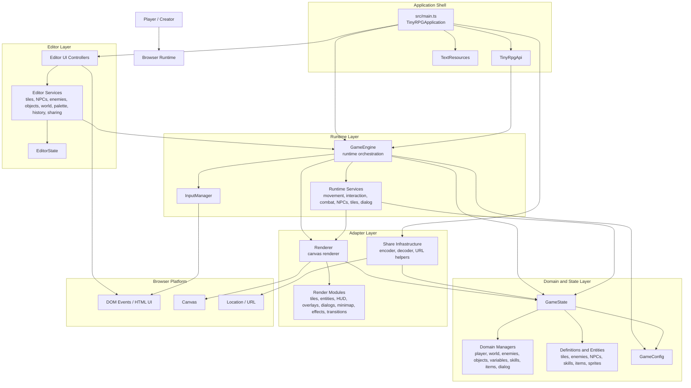
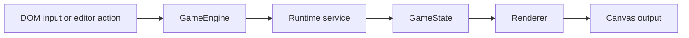

# Engine Architecture

This document describes the Tiny RPG Maker engine as an architecture diagram rather than a class inventory.

## Architecture Overview

## Layer Responsibilities

### Application shell

- `src/main.ts` composes the application.
- It wires the game runtime, editor, localization, and sharing entry points.
- It also exposes `TinyRpgApi` as a thin integration surface.

### Editor layer

- The editor is centered on `src/editor/EditorManager.ts`.
- Its job is authoring and inspection, not core gameplay logic.
- Editor services mutate game data through `GameEngine`, which keeps runtime behavior consistent between play mode and edit mode.

### Runtime layer

- `src/runtime/services/GameEngine.ts` is the orchestration boundary for live gameplay.
- It coordinates input, movement, combat, dialog, NPC behavior, enemy loops, and redraws.
- Runtime services contain gameplay workflows and call into state plus rendering.

### Domain and state layer

- `src/runtime/domain/GameState.ts` is the central state boundary.
- It owns the persistent game definition and the mutable runtime state.
- Specialized state managers partition responsibilities for player state, world state, enemies, objects, variables, skills, items, and dialog.

### Adapter layer

- `Renderer` is the visual adapter between engine state and the canvas.
- Share infrastructure is the serialization adapter between game data and URLs/export formats.
- These modules sit outside the core domain and translate state into platform-facing behavior.

## Architectural Reading

- The architecture is centered on `GameEngine` as the orchestrator and `GameState` as the source of truth.
- The editor is not a separate engine. It is a client of the runtime.
- Rendering and sharing are adapters around the domain, not the domain itself.
- Configuration and static definitions feed both runtime behavior and editor tooling.

## Main Runtime Flow

## Why this is the architecture

- It shows subsystem boundaries instead of every concrete class.
- It makes the dependency direction explicit.
- It separates orchestration, domain state, adapters, and authoring tooling.
- It matches the current codebase structure in `src/main.ts`, `src/editor/`, `src/runtime/services/`, `src/runtime/domain/`, `src/runtime/adapters/`, and `src/runtime/infra/share/`.
