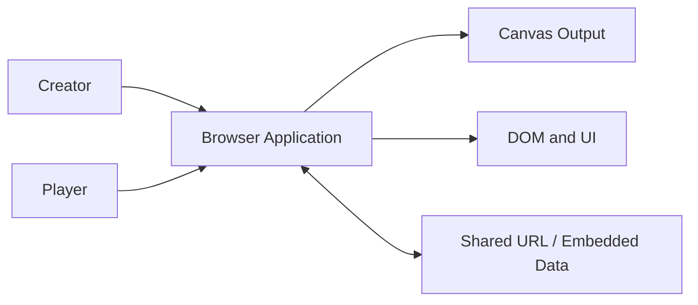
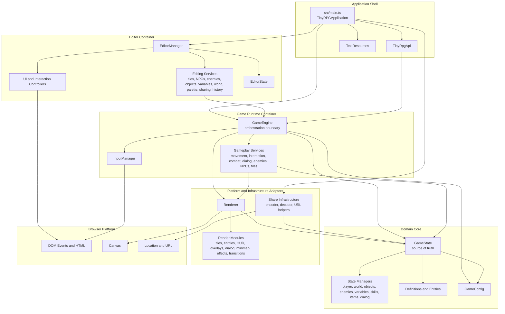
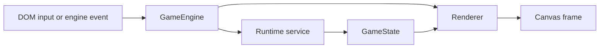
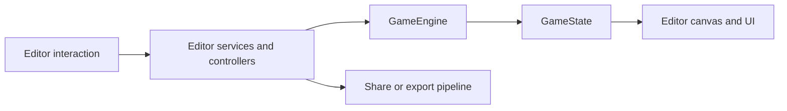

# Tiny RPG Maker Engine Architecture

This document presents the engine as a runtime architecture, not as a flat list of classes. The goal is to explain how the system is structured, where responsibility lives, and why the current shape is strategically sound for a browser-based game engine with an integrated editor.

## Executive Summary

Tiny RPG Maker is architected as a browser-native game platform with a shared runtime core. The same runtime that executes the game is also the engine that the editor writes into. That is the most important architectural decision in the codebase.

This produces four useful properties:

- gameplay and authoring operate on the same rules and data model
- rendering is isolated as a platform adapter around the core state
- sharing and import/export remain infrastructure concerns instead of leaking into gameplay logic
- the application can remain fully client-side while still supporting editing, previewing, and serialized distribution

## Architectural Drivers

The current structure strongly suggests these drivers:

1. Single source of truth for game behavior
2. Browser-first execution with no runtime backend dependency
3. Tight feedback loop between editor and playable runtime
4. Low-friction game sharing through URLs and exported data
5. Modular rendering and gameplay services without duplicating the domain model

## System Context

At the highest level, this is a self-contained browser application used in two roles:

- as a game runtime for players
- as an authoring environment for creators

## Container Architecture

## Architectural Thesis

The architecture is intentionally centered around two core elements:

- `GameEngine` as the orchestration boundary
- `GameState` as the domain and state boundary

Everything else is either:

- a client of the engine
- a specialized service behind the engine
- or an adapter translating state to browser-facing behavior

That separation is what keeps the system understandable.

## Responsibilities by Layer

### 1. Application shell

`src/main.ts` is composition code. It should not own business rules. Its role is to wire the system together:

- initialize the runtime
- initialize the editor when applicable
- bind browser events and tab switching
- expose `TinyRpgApi` as a narrow integration surface
- load shared game data from URL or embedded export payloads

This is a good boundary. Bootstrapping is kept outside the core engine.

### 2. Editor layer

The editor is centered on `src/editor/EditorManager.ts` and its service modules. Architecturally, the editor is a consumer of the runtime, not a parallel implementation of game rules.

That is the right decision.

Instead of inventing a second game model for authoring, the editor writes through the same engine and state model used during play. This reduces behavioral drift and avoids the classic failure mode where editor data looks valid but behaves differently at runtime.

The editor layer therefore owns:

- authoring workflows
- selection and editing state
- editor-focused rendering and UI
- undo/redo and palette workflows
- import/export actions from the authoring side

It should not own gameplay rules.

### 3. Runtime layer

`src/runtime/services/GameEngine.ts` is the system coordinator. It sits between UI/input and the domain core.

Its role is to:

- receive high-level actions
- delegate to gameplay services
- trigger draw cycles
- coordinate resets, intro flow, overlays, and enemy loop timing
- expose coarse-grained operations to the editor and public API

This is not the domain model. It is the orchestration layer around the domain model.

That distinction matters. Orchestration can change frequently. Core state semantics should change much more carefully.

### 4. Domain core

`src/runtime/domain/GameState.ts` is the source of truth for both:

- persistent game definition
- mutable runtime state

The decomposition into specialized state managers is the correct scaling move. It prevents `GameState` from collapsing into a single unmaintainable god object, even though it still acts as the aggregate root.

The domain core owns:

- player progression and runtime stats
- room/world structure
- enemies, objects, items, and variables
- dialog and level-up overlays
- import/export normalization
- lifecycle transitions such as pause, resume, game over, and revive

This layer should remain the most stable part of the architecture.

### 5. Rendering and infrastructure adapters

The adapter layer translates domain/runtime concepts into browser-facing implementation details.

`Renderer` is a rendering facade over a set of specialized modules. That is a healthy shape for a growing engine because it allows visual complexity to increase without forcing the engine orchestration layer to absorb rendering detail.

The share stack under `src/runtime/infra/share/` is also correctly placed. Serialization, compact encoding, and URL transport are infrastructure concerns. They should depend on the game model, not the other way around.

## Dependency Rules

The architecture works because dependency direction is mostly coherent. The intended rules are:

1. The editor depends on the engine, not the inverse.
2. The engine depends on domain state and adapters.
3. Gameplay services depend on domain state and may request rendering side effects.
4. Adapters depend on domain data but should not define domain rules.
5. Configuration and static definitions are upstream inputs to both runtime and editor.

If these rules are preserved, the codebase remains extensible.

## Runtime Control Flow

This is the dominant runtime loop:

- an action enters through browser input or an internal engine event
- `GameEngine` routes the action to the appropriate runtime service
- the service mutates `GameState`
- the renderer projects the updated state into a new frame

## Authoring Control Flow

This is the key architectural strength of the product: editor actions are not writing to a disconnected authoring model. They flow into the same runtime-backed representation.

## Strengths of the Current Design

- The editor and runtime share a single behavioral core.
- `GameEngine` provides a clear operational entry point for the application.
- `GameState` provides a stable aggregate root around which specialized managers are organized.
- Rendering is sufficiently modular to scale visually without turning the engine into a canvas script blob.
- Sharing/export logic is isolated in infrastructure modules rather than mixed into gameplay services.

## Architectural Risks and Watchpoints

This design is solid, but there are predictable pressure points:

- `GameEngine` can become too wide if every new feature is added as another direct responsibility instead of through service boundaries.
- `GameState` is still a central aggregate and can drift toward excessive surface area if manager boundaries are not enforced.
- Some runtime services currently know about rendering side effects. That is acceptable in a small browser engine, but it should stay disciplined.
- The editor depends deeply on runtime behavior. That is strategically good, but it means runtime API stability matters a lot for authoring velocity.

These are not failures. They are the natural scaling constraints of the current architecture.
